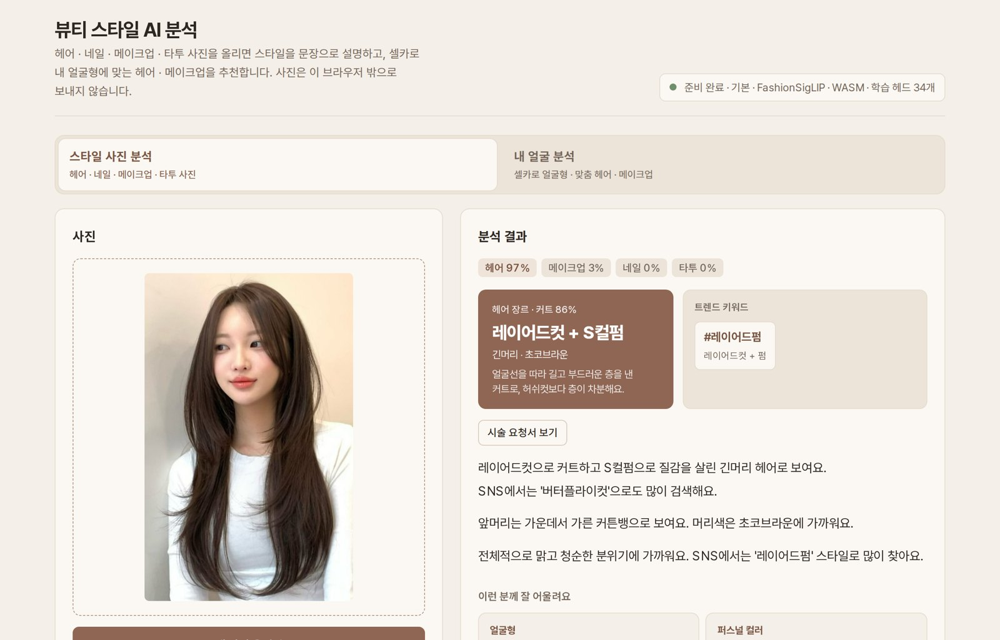
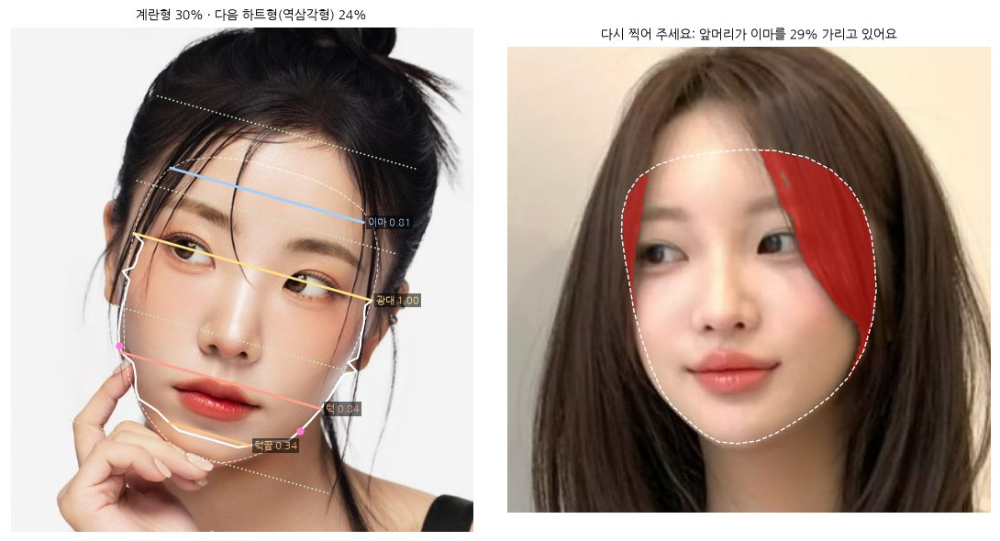

# FINDE — 중간평가 보고서

**인공지능 소프트웨어 · 오경민** · 2026년 10월

**데모** https://huggingface.co/spaces/kyoungminOh/beauty-style-ai · **소스** https://github.com/rudals906377/AI · **파이썬 소스** `notebook/beauty_style_ai.ipynb`

## 1. 요약

헤어 · 네일 · 메이크업 · 타투 **사진 한 장**을 넣으면 스타일 이름(장르), SNS 트렌드 키워드, 한국어 설명, 해시태그, 매장에 보여 줄 **시술 요청서**, 사진 속 실제 색, **이 스타일이 잘 어울리는 사람**을 알려 주는 웹 서비스를 만들었다. 셀카를 올리면 **얼굴형을 재고 맞춤 헤어 · 메이크업을 추천**하는 기능도 있다.

모든 AI 모델은 **Transformers.js** 와 MediaPipe 로 **이용자의 브라우저 안에서** 실행되어 사진이 서버로 나가지 않는다. 비전 모델의 제로샷 분류에 직접 학습한 분류기를 얹어 속성 정확도를 **53% → 73\~78%** 로 올렸고, 확률을 보정해 "\~예요"로 단정한 문장의 **96%** 가 맞도록 했다.

## 2. 문제와 목표

미용실 · 네일숍에서 사진을 보여 주며 "이렇게 해 주세요"라고 해도, 스타일 이름(허쉬컷인지 레이어드컷인지, 자석 네일인지 크롬 네일인지)을 모르면 검색도 설명도 어렵다. 목표는 다음과 같다.

- 사진 한 장을 **한국에서 실제로 쓰는 용어**로 설명한다 (라벨 324개).
- **확실한 것만 단정**하고, 애매하면 "\~로 보여요"라고 말하며, 더 애매하면 말하지 않는다.
- 결과를 **바로 쓸 수 있는 형태**(시술 요청서, 해시태그, 맞춤 추천)로 정리한다.
- 얼굴이 나오는 사진이 많으므로 **사진을 밖으로 보내지 않는다**.

## 3. 사용한 모델과 사용 방법

| 모델 | 역할 | 사용 방법 |
|---|---|---|
| `Marqo/marqo-fashionSigLIP` (기본, 94MB) | 사진 → 768차원 특징값 | Transformers.js 로 ONNX 8비트 모델을 브라우저에서 실행. 미리 계산한 라벨 324개의 문장 임베딩과 비교(제로샷) + 직접 학습한 분류 헤드 34개 + 확률 보정 |
| `Xenova/siglip-large-patch16-384` (정밀) | 같은 역할, 더 큰 모델 | 설정에서 고름. WebGPU 는 4비트(208MB), CPU 는 8비트(329MB). 학습 헤드 33개 |
| `onnx-community/LFM2.5-VL-450M-ONNX` (고급 모드) | 사진을 보고 자유 서술 | 선택 기능. 영어로 관찰한 뒤 용어집으로 한국어로 옮긴다. 생성형이라 "사실과 다를 수 있음"을 표시 |
| MediaPipe 머리카락 분할 · 얼굴 랜드마크 · 손 랜드마크 | 부위 찾기 | 머리카락 · 입술 · 눈두덩 · 손끝 픽셀만 골라 CIE Lab 색 공간에서 대표색을 뽑는다 (사진 속 색) |
| MediaPipe 얼굴 랜드마크 478점 + 부위 분할(`selfie_multiclass`) | 내 얼굴 분석 | 얼굴 피부 · 머리카락 · 목 · 손을 픽셀 단위로 나눠 실제 턱선 · 헤어라인을 찾고 얼굴형을 잰다 |
| Claude (Anthropic) | 학습 데이터 라벨링 보조 | 라벨 기준 문서에 따라 사진을 한 장씩 보고 라벨을 달았다. 서비스 실행에는 쓰지 않는다 |

기본 모델은 후보 6종을 같은 평가 사진(210장)으로 제로샷 비교해 골랐다. 정확도와 브라우저에서 내려받을 크기를 함께 보았다.

| 모델 | 카테고리 판별 | 속성 판단 |
|---|---|---|
| CLIP ViT-B/16 | 89.5% | 59.2% |
| CLIP ViT-L/14 | 90.5% | 61.0% |
| SigLIP2-base | 84.8% | 51.4% |
| SigLIP-base | 94.3% | 70.6% |
| SigLIP-large/384 | 91.9% | 75.7% |
| **FashionSigLIP (채택)** | **92.9%** | **73.9%** |

## 4. 데이터

- **라벨 사전**: 2024\~2026년 한국 매거진 · 예약 플랫폼 · 커뮤니티 용어 약 440개를 조사해 324개로 정리했다. 헤어 9 · 네일 8 · 메이크업 11 · 타투 5그룹이며, 라벨마다 한국어 이름 · 영어 묘사 문장 · 한 줄 정의가 있다 (예: 칼단발, 애즈펌, 자석 네일, 숙취 블러셔).
- **학습 사진 2,197장**: 상업 이용과 개작이 허용된 자유 라이선스 사진(Openverse · Wikimedia Commons) 2,099장과 한국 스타일 사진 98장. 사진마다 출처 · 작가 · 라이선스를 기록했다.
- **라벨링**: 라벨 기준 문서(`data/LABELING_RULES.md`)에 따라 AI 가 라벨을 달고, 두 라벨러의 교차 검수 일치율은 92% 였다. 이 값이 사실상 정확도의 상한이다.
- **평가**: 학습에 쓰지 않은 평가 세트(사진 210장, 속성 812개)와 출처 단위 5겹 교차 검증을 함께 썼다.

## 5. 방법

1. **제로샷 분류**: 라벨마다 영어 묘사를 여러 문장 틀에 넣어 텍스트 임베딩을 평균 낸다. 사진 특징값 `v` 와의 유사도로 확률을 만든다: `softmax(100 · T·v)`.
2. **분류 헤드 학습** (`tools/train-heads.py`): 그룹마다 가중치를 라벨 문장 임베딩에서 출발시키고(`logits = t · (T + Δ) · v + b`), `Δ` 에 L2 벌점을 줘 제로샷에서 크게 벗어나지 않게 했다. 그래서 사진이 그룹당 수십\~수백 장이어도 안정적이다. 정답이 여러 개일 수 있는 약한 라벨은 partial-label 손실로 학습했다. 벌점 λ 와 제로샷과 섞는 비율 α 는 출처 단위 교차 검증(같은 작가 · 앨범 사진은 같은 폴드)으로 골랐다.
3. **확률 보정**: 폴드 밖 예측으로 그룹마다 온도를 맞춰, 화면에 90% 라고 나온 판단이 실제로 90% 이상 맞게 했다.
4. **메이크업은 부위를 잘라서 본다**: 섀도 · 라인 · 립은 사진 전체에서 몇 픽셀뿐이라 가장 약했다. 얼굴 랜드마크로 눈(눈썹 포함) · 입술 · 얼굴 영역을 잘라 따로 임베딩하고, 그룹마다 전체 사진 · 얼굴 · 눈 · 입술 중 교차 검증이 가장 좋은 영역의 헤드를 쓴다. 얼굴을 못 찾으면 전체 사진으로 판단한다.
5. **문장 조립** (`describe.js`): 생성형 모델이 아니라 규칙으로 조립해 없는 내용을 지어내지 않는다. 보정 확률 90% 이상은 "\~예요", 50\~90% 는 "\~로 보여요", 그 아래는 문장에서 빼고 후보 막대로만 보여 준다. 받침에 따라 조사를 고른다.
6. **결과물**: 장르 · 트렌드 키워드, 시술 요청서(확실한 항목은 표로, 애매한 항목은 "상담 때 정할 것"으로), 사진 속 색(헤어 레벨 포함), 비슷한 예시 스타일 3장, 라벨 324개의 용어 설명, **이런 분께 잘 어울려요**(스타일 특징에 일반 스타일링 기준을 적용해 얼굴형 · 퍼스널 컬러 · 어깨선 · 체형 · 모질 · 추구미 등을 분야별로 추천, 확신 50% 미만인 특징은 근거로 쓰지 않음).

## 6. 내 얼굴 분석

셀카 한 장으로 얼굴 비율을 재고 맞춤 헤어 · 메이크업을 추천한다 (`face.js` · `face-advice.js`).

1. **좌표 맞추기**: 양쪽 광대 방향을 가로축, 턱끝 → 이마를 세로축으로 하는 얼굴 좌표계로 옮겨 고개 기울기를 보정한다.
2. **측정**: 이마 · 광대 · 턱 · 턱끝 너비, 얼굴 길이(헤어라인\~턱끝), 삼정(이마 : 눈썹\~코 : 코\~턱), 턱 모서리 각도, 미간 · 눈꼬리 · 콧볼 · 입술 비율. 랜드마크 윤곽은 평균 얼굴 쪽으로 끌리는 경향이 있어서, 턱선 · 턱끝 · 헤어라인은 **부위 분할 마스크의 실제 얼굴 피부 가장자리**를 썼다. 그러자 턱 각도의 표준편차가 1.8° 에서 4.6° 로 늘어 얼굴마다의 차이를 구별하게 됐다.
3. **가림 점검**: 이마 안쪽과 얼굴선 안쪽 띠에서 머리카락 · 손 픽셀 비율을 센다. 앞머리 · 옆머리 · 손이 얼굴선을 가리거나 고개가 12° 넘게 돌아갔거나 입을 벌리면 **재지 않고**, 가린 곳을 붉게 칠해 무엇을 고칠지 알려 준다.
4. **얼굴형**: 측정값을 예시 얼굴 사진 24장의 평균 · 표준편차로 표준점수화하고, 6가지 얼굴형(계란 · 둥근 · 긴 · 각진 · 하트 · 마름모)의 특징 방향과의 거리로 확률을 낸다. 두 얼굴형이 비슷하면 "A와 B의 중간"으로 표시한다.
5. **추천**: 헤어는 추천 커트 · 앞머리 · 기장 · 가르마 · 피할 스타일, 메이크업은 쉐딩 · 하이라이터 · 블러셔 위치를 얼굴 위에 그려 주고 눈썹 · 아이라인 · 입술 · 비율 보정을 추천한다. 직전에 분석한 스타일과의 궁합도 알려 준다.

## 7. 실험 결과 (모두 학습에 쓰지 않은 사진으로 잰 값)

| 측정 | 제로샷 | 기본 + 학습 헤드 | 정밀 + 학습 헤드 |
|---|---|---|---|
| 속성 정확도 (교차 검증, 속성 2,257개) | 53.0% | 73.4% | **75.4%** |
| 평가 세트 속성 정확도 (812개) | 58.0% | 75.1% | **78.0%** |
| 한국 스타일 사진 (교차 검증, 718개) | 53.2% | 72.3% | **74.5%** |
| 뷰티 사진 판별 | 80.1% | **95.8%** | 94.8% |
| "\~예요"로 단정한 문장의 적중률 | – | 96.3% | **96.9%** |
| 사진 1장 분석 시간 (브라우저, 4코어 CPU) | | 약 0.6초 | 약 5초 |

- **라벨의 질이 양보다 중요했다.** 검색어로 자동 라벨을 단 1만 장은 효과가 없었고(73.9% → 73.4%), 사진을 직접 보고 단 280장은 +5.9%p 를 올렸다. 한국 스타일 사진 98장을 더하자 한국 사진 정확도가 67.0% → 76.7% 로 올랐다.
- **잘하는 것과 못하는 것**: 네일 부위(99.6%) · 헤어 기장(85.7%) · 메이크업 포인트(89.6%)는 잘 맞히고, 아이섀도 · 아이라인 · 메이크업 톤처럼 몇 픽셀 차이로 갈리는 메이크업 그룹이 약하다.
- **메이크업 부위 크롭의 효과** (메이크업 학습 사진 386장, 같은 사진으로 전체 vs 크롭 5겹 교차 검증): 아이섀도 50.6 → 64.4%, 아이라인 55.1 → 64.0%, 속눈썹 71.5 → 75.1%, 립 컬러 59.4 → 80.6%, 립 표현 72.9 → 78.5%, 포인트 63.0 → 68.0%. 무드 · 눈썹 · 치크 · 피부 표현은 전체 사진이 더 나아 그대로 두었다.
- **파이썬 재현**: 노트북에서 같은 모델 · 라벨 임베딩 · 학습 헤드로 예시 사진 5장을 분석한 결과, 웹 앱(8비트)과 속성 1위가 **95%(40/42)** 일치했다. 특징값의 코사인 유사도는 0.96\~0.98 이었다. 내 얼굴 분석은 웹 앱과 같은 측정값과 얼굴형 확률을 냈다.

## 8. 구현과 실행

| 구성 | 파일 |
|---|---|
| 화면 · 입력 · 결과 | `index.html` · `style.css` · `app.js` |
| 분석 (카테고리 · 속성 · 보정) | `analyzer.js` · `encoders.js` · `taxonomy.js` |
| 문장 · 요청서 · 추천 · 색 | `describe.js` · `order.js` · `suits.js` · `colors.js` |
| 내 얼굴 분석 | `face.js` · `face-advice.js` · `face-ui.js` |
| 학습 · 배포 | `tools/train-heads.py` · `tools/deploy-space.py` (main 에 올리면 GitHub Actions 가 Hugging Face Space 로 배포) |
| 파이썬 소스 (제출용) | `notebook/beauty_style_ai.ipynb` · `.py` — 위 과정을 파이썬으로 옮겨 실행 결과까지 담았다. Colab 에서 바로 실행된다 |
| 문서 | `docs/MODEL_CARD.md` (그룹별 정확도 · 한계) · `notice.html` (AI 이용 안내) · `review.html` (전문가 검수 도구) |

## 9. 한계와 다음 단계

- **메이크업이 가장 약하고**(약 67%), 학습 사진이 서양 스타일 위주이며, 라벨을 현장 전문가가 아직 검수하지 않았다. 전문가 검수 도구로 분야별 채점을 받아 다시 학습할 계획이다.
- **내 얼굴 분석**은 사진 한 장의 2D 비율이라 카메라 거리 · 각도 · 표정에 따라 달라진다. 얼굴형 기준값이 한국 스타일 사진 24장의 평균이라 다른 연령 · 성별에는 치우칠 수 있고, 전문가가 판정한 얼굴형과의 일치율은 아직 재지 않았다. 결과는 진단이 아닌 참고용으로 표시한다.
- 예시 사진 · 한국 스타일 학습 사진 98장은 권리를 확인하지 않아, 상업 출시 전에 권리를 확보하거나 빼고 다시 학습해야 한다.

## 참고

- Transformers.js (Hugging Face, Apache-2.0) · MediaPipe Tasks Vision (Google, Apache-2.0) · open_clip (파이썬 재현)
- Marqo FashionSigLIP · Google SigLIP · Liquid AI LFM2.5-VL (LFM Open License) · MediaPipe 모델 카드 (selfie_multiclass, Apache-2.0)
