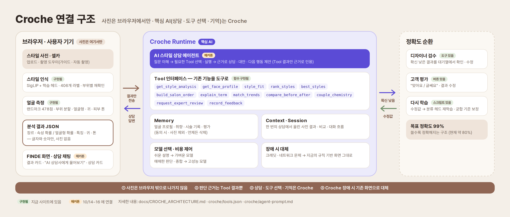
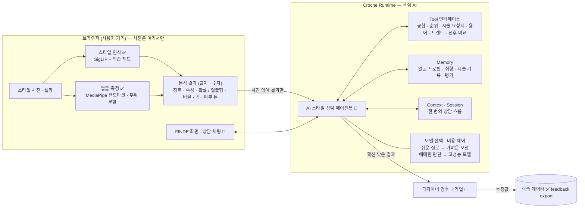
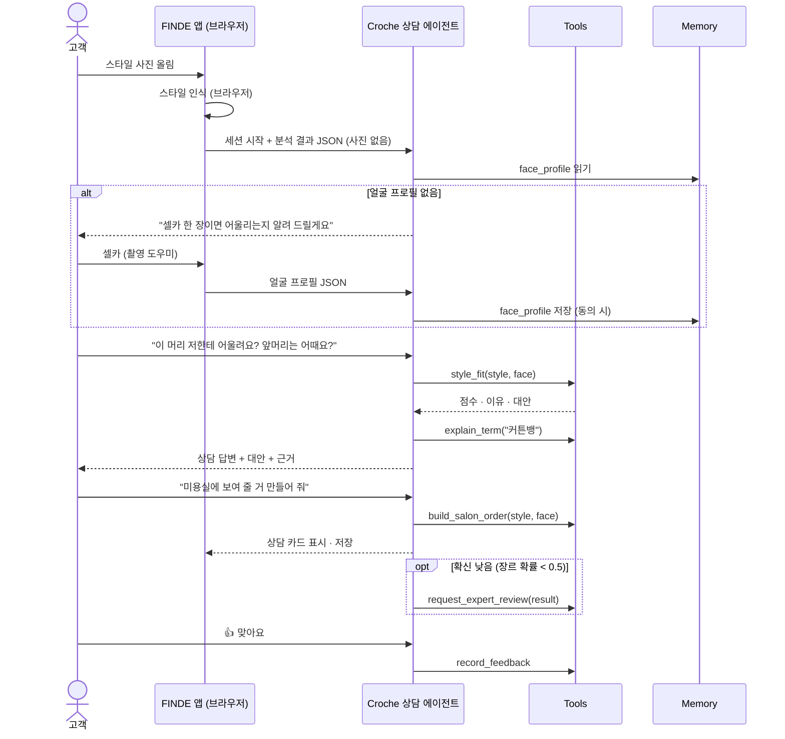

# Croche 연결 구조 설계 (해커톤용)

> 목적: 해커톤 규정 10번 — "결과물의 핵심 AI 기능에는 Croche를 활용해야 합니다" — 을 지키면서,
> 지금까지 만든 분석 기능과 "사진은 브라우저 밖으로 나가지 않아요" 원칙을 그대로 살린다.
> Croche SDK 의 실제 함수 이름 · 호출 방식은 10/14 오리엔테이션 이후 공개되므로, 이 문서는 **연결 지점(어댑터)만 바꿔 끼우면 되도록** 나머지를 정해 둔다.
> 표시: ✅ 이미 구현됨 · 🔧 해커톤 기간에 구현 · ❓ 오리엔테이션에서 확인

## 1. 한눈에 보기





핵심 원칙
1. **사진은 브라우저에서만 처리한다.** Croche 에는 분석 결과(글자 · 숫자)만 보낸다 → 개인정보 문구 유지.
2. **판단의 근거는 Tool 결과뿐이다.** 에이전트(LLM)는 숫자 · 라벨을 지어내지 않고, Tool 이 돌려준 값을 설명 · 비교 · 조언하는 데만 쓴다.
3. **Croche 가 핵심 흐름을 맡는다.** 상담 대화 · 도구 선택 · 기억 · 모델 선택 · 검수 연결이 모두 Croche 위에서 돈다 (규정 10번).
4. **Croche 가 안 되면 지금 화면 그대로.** 네트워크 · 크레딧 문제 시 규칙 기반 결과(현재 사이트)를 그대로 보여 준다.

## 2. 역할 나누기

| 층 | 맡는 일 | 실행 위치 | 상태 |
|---|---|---|---|
| 시각 인식 | 사진 → 스타일 장르 · 속성 확률, 셀카 → 얼굴 측정값 | 브라우저 (Transformers.js · MediaPipe) | ✅ `analyzer.js` · `face.js` |
| 규칙 · 계산 | 궁합 점수, 순위, 시술 요청서, 트렌드 이름, 전후 비교 | 브라우저 함수 → **Croche Tool 로 노출** | ✅ 함수 · 🔧 Tool 등록 |
| 상담 · 설명 | 질문 이해, 필요한 Tool 선택 · 실행, 결과 종합, 상담 말투로 설명, 다음 행동 제안 | **Croche 에이전트** | 🔧 |
| 기억 | 얼굴 프로필 · 취향 · 시술 기록 · 평가 | **Croche Memory** (지금은 localStorage) | ✅ 로컬 · 🔧 이전 |
| 품질 | 확신 낮은 결과 → 디자이너 검수, 고객 평가 집계 | Croche Tool + 검수 도구 | ✅ `review.html` · 🔧 연결 |

## 3. Tool 목록 (초안)

입력 · 출력은 모두 JSON. 사진 · 픽셀은 절대 넣지 않는다. 스키마 초안은 [`croche/tools.json`](../croche/tools.json).

| Tool | 하는 일 | 지금 함수 | 실행 |
|---|---|---|---|
| `get_style_analysis` | 사용자가 올린 스타일 사진의 분석 결과를 가져온다 (장르 · 속성 · 확률 · 트렌드) | `analyzer.analyze()` → `slim()` | 클라이언트 ❓ |
| `get_face_profile` | 현재(또는 기억한) 얼굴 프로필 (얼굴형 확률 · 비율 특징 · 귀 · 피부 속 색) | `analyzeFace()` → `slim()` (face-ui) | 클라이언트 ❓ |
| `style_fit` | 스타일 1개 × 얼굴 → 궁합 점수 · 이유 · 대안 | `styleFit()` | 어디서든 (순수 함수) |
| `rank_styles` | 스타일 여러 개 × 얼굴 → 순위 | `rankStyles()` | 어디서든 |
| `best_styles` | 예시 스타일 사전에서 내 얼굴형 TOP N | `rankStyles(samples/styles.json)` | 어디서든 |
| `build_salon_order` | 시술 요청서 · 상담 카드 내용 | `buildOrder()` + `consultInfo()` | 어디서든 |
| `explain_term` | 스타일 용어 뜻 (406개 라벨 사전) | `taxonomy.js` 의 `def` | 어디서든 |
| `match_trends` | 속성 조합 → 트렌드 이름 (210개) | `matchTrends()` | 어디서든 |
| `compare_before_after` | 시술 전후 머리 실루엣 변화 | `compareFrames()` | 클라이언트 ❓ |
| `couple_chemistry` | 두 얼굴형 케미 (재미용) | `coupleChem()` | 어디서든 |
| `request_expert_review` | 확신 낮은 결과를 디자이너 검수 대기열로 | 🔧 새로 | 서버 · Croche |
| `record_feedback` | '맞아요 / 글쎄요' 평가 · 수정값 저장 | 지금 localStorage → 🔧 Memory | Croche |

**클라이언트 Tool** (사진이 필요한 것) 은 두 가지 방법 중 Croche 가 지원하는 쪽을 쓴다 ❓
- **A. 먼저 분석 → 결과를 컨텍스트로** (가장 단순, 어떤 SDK 든 가능): 사진을 올리면 브라우저가 바로 분석하고 결과 JSON 을 세션 컨텍스트에 넣는다. 에이전트는 `get_style_analysis` 로 그 값을 읽기만 한다.
- **B. 에이전트가 요청 → 앱이 실행**: SDK 가 클라이언트 측 Tool 실행(tool call 을 앱이 받아 실행하고 결과를 돌려주는 방식)을 지원하면, 에이전트가 필요할 때 사진 분석을 요청한다.

순수 함수 Tool (`style_fit` 등) 은 같은 JS 를 그대로 쓰면 되므로 Croche 의 Tool 실행 위치(서버 · 클라이언트)에 맞춰 옮기기만 하면 된다.

## 4. Memory 설계

| 키 | 내용 | 보존 | 비고 |
|---|---|---|---|
| `face_profile` | 얼굴형 확률 · 비율 특징(z 값) · 귀 상태 · 피부 밝기/색 기울기 · 잰 날짜 | 사용자가 지울 때까지 | 지금 `beauty-face-memo-v1` 와 같은 내용. **사진 없음** |
| `preferences` | 좋아한 스타일 · 피하고 싶은 스타일 · 추천 기준(성별 선택값) | 사용자가 지울 때까지 | 상담 중 "이건 싫어요" 같은 말에서 갱신 |
| `history` | 상담 날짜 · 고른 스타일 · 상담 카드 요약 · 전후 비교 결과 | 최근 N회 | 재방문 시 "지난번 레이어드컷 이후 어떠세요?" |
| `feedback` | 궁합 판단별 평가 · 수정값 | 집계 후 익명화 | 점수 기준 보정 · 학습용 (동의 시) |

- 동의: 처음 저장할 때 한 번 묻고, "기억 지우기" 버튼으로 전부 삭제 (지금 '내 얼굴형 기억하기' 체크와 같은 방식).
- 사진 · 얼굴 좌표(랜드마크) 원본은 Memory 에 넣지 않는다.

## 5. 상담 세션 흐름 (예)



## 6. 에이전트 지침 (프롬프트 초안 요지)

전문은 [`croche/agent-prompt.md`](../croche/agent-prompt.md).
- 역할: 경력 많은 헤어 디자이너 겸 뷰티 에디터. 전문적이되 딱딱하지 않게, 중간중간 위트.
- 근거: 숫자 · 라벨 · 점수는 **Tool 결과만** 인용. 모르면 "사진이 조금 더 필요해요".
- 존중: "얼굴 비율을 근거로 한 참고용 추천이에요. 각자의 취향과 개성을 존중합니다." 를 첫 추천 때 한 번.
- 금지: 사진으로 성별 · 나이 · 인종 추정, 외모 비하, 의료적 판단, 다른 사람 사진을 동의 없이 분석하도록 유도.
- 동물 · 인형: 재미로 분석하되 사람 기준 결과임을 밝힘. 여러 사람 사진은 한 사람만 올려 달라고 안내.

## 7. 모델 선택 · 비용 제어

| 상황 | 모델 | 이유 |
|---|---|---|
| 분석 결과 설명 · 짧은 답 · 상담 카드 문장 | 가벼운 모델 | 대부분의 대화. Tool 결과를 풀어 말하는 일 |
| 장르 확률 < 0.5 이거나 여러 스타일 비교 · 장단점 종합 | 고성능 모델 | 애매한 판단 · 여러 근거 종합 |
| 같은 질문 반복 (용어 뜻 등) | 캐시 · Tool 결과 바로 | 크레딧 절약 |

- 세션당 Tool 호출 · 토큰 상한을 두고, 넘으면 "요약 카드"로 마무리.
- 크레딧 · 네트워크 오류 → 지금 사이트의 규칙 기반 화면으로 자동 전환 (기능 손실 없음).

## 8. 파일 구성 (해커톤 기간에 만들 것)

```
croche/
  tools.json          Tool 이름 · 설명 · 입력/출력 스키마 (초안 ✅)
  agent-prompt.md     에이전트 지침 (초안 ✅)
  adapter.js          Croche SDK 호출부 — 여기만 SDK 에 맞춰 바꾼다 🔧
  tools.js            Tool 이름 → 기존 함수 연결 (styleFit, rankStyles, buildOrder …) 🔧
  memory.js           face_profile · preferences · history 읽기/쓰기 (지금 localStorage → Croche Memory) 🔧
chat-ui.js            상담 채팅 화면 (결과 카드 아래 "AI 상담사에게 물어보기") 🔧
```

`adapter.js` 의 모양 (SDK 공개 후 안쪽만 채움):

```js
// Croche SDK 를 감싸는 얇은 층 — 앱의 나머지 코드는 이 세 함수만 쓴다
export async function startSession({ userId, context }) { /* Croche session 생성, 분석 결과 JSON 을 context 로 */ }
export async function send(session, message, { onToolCall, onDelta }) { /* 메시지 전송 · 스트리밍 · tool call 처리 */ }
export async function memory(op, key, value) { /* Croche Memory get/set/delete */ }
```

## 9. 10/17 시연 시나리오 (PDF 에 같은 범위를 적는다)

1. 스타일 사진 업로드 → 브라우저 분석 결과 카드
2. "AI 상담사에게 물어보기" → "이거 저한테 어울려요?" → 셀카 요청 → 촬영 도우미로 자동 촬영
3. 에이전트가 `style_fit` · `explain_term` 을 써서 상담 답변 (근거 · 대안 포함)
4. "미용실에 보여 줄 카드 만들어 줘" → `build_salon_order` → 상담 카드 저장
5. 새로고침 후 다시 열면 Memory 로 "지난번 각진형 기준으로 볼게요" — 사진 없이 이어지는 상담
6. 확신 낮은 사진을 올리면 검수 대기열로 가는 모습 (검수 도구 화면)

시연 사진은 **본인 · 팀원 · 동의받은 사진만** 쓴다 (규정 11번). 예시 사진 100장과 FFHQ 시험 사진은 쓰지 않는다.

## 10. 오리엔테이션에서 확인할 것 ❓

- [ ] 해커톤 전에 만든 분석 기능을 Tool 로 가져와 써도 되는지
- [ ] Tool 실행 위치: 클라이언트 측 Tool(앱이 실행하고 결과 반환) 지원 여부 → 3장 A/B 결정
- [ ] 이미지 입력을 Croche 로 보내야만 하는지 (보내지 않고 결과만 보내도 되는지)
- [ ] Memory 의 보존 기간 · 삭제 API · 사용자별 분리 방식
- [ ] 지원 LLM 목록 · 크레딧 한도 · 모델 자동 추천 방식
- [ ] 웹(브라우저)에서 SDK 를 직접 쓸 수 있는지, 아니면 백엔드가 필요한지
- [ ] 표준 AI Tools 중 쓸 만한 것 (예: 웹 검색 → 트렌드 갱신, 이미지 생성 → 스타일 미리보기)
